# Arquitetura Oficial: 3 Projetos 100% Independentes e Autônomos

Data de Validação: 09 de Julho de 2026  
Status: **Validado e Aprovado via Brainstorming**  
Repositório Principal: `C:\Users\Administrator\Downloads\Github\MELHORAR`

---

## 1. Resumo do Entendimento (Understanding Summary)

O objetivo desta arquitetura é estabelecer **3 aplicações corporativas 100% independentes, modulares e autônomas**, desenvolvidas em **Next.js 16 (App Router)**. Cada projeto é capaz de rodar, ser testado, mantido e implantado separadamente sem nenhuma dependência de serviços externos, bancos centralizados ou dos outros projetos irmãos.

### Por que esta arquitetura existe?
* **Zero Acoplamento:** Evita pontos únicos de falha e complexidades desnecessárias de orquestração (*YAGNI*).
* **Pronto para Produção e Demonstração:** Cada aplicação inclui sua própria UI profissional, APIs nativas funcionais e persistência autocontida.
* **Escalabilidade Modular:** Permite evoluir, conteinerizar ou publicar cada projeto de forma totalmente independente.

---

## 2. Visão Geral dos 3 Projetos Independentes

```mermaid
graph TD
    subgraph P1 ["1. SaaS Vulnerability Scanner (Porta 3001)"]
        UI1["Frontend React / Next.js UI"]
        API1["API /api/scan (Motor SAST / Entropia)"]
        MEM1["Armazenamento Autônomo de Histórico"]
        UI1 <--> API1 <--> MEM1
    end

    subgraph P2 ["2. ITSM Triagem Inteligente (Porta 3002)"]
        UI2["Frontend React / 5 Visões Interativas"]
        API2["API /api/tickets, /api/stats, /api/settings"]
        MEM2["Motor NLP ITIL 4 + Base de Tickets"]
        UI2 <--> API2 <--> MEM2
    end

    subgraph P3 ["3. NetOps Analyzer (Porta 3003)"]
        UI3["Frontend React / Gráficos de Telemetria"]
        API3["API /api/ping (Disparo ICMP no OS)"]
        MEM3["Métricas e Estatísticas em Tempo Real"]
        UI3 <--> API3 <--> MEM3
    end
```

---

## 3. Especificação Técnica Detalhada de Cada Projeto

### 3.1. SaaS Vulnerability Scanner (`/saas-vulnerability-scanner`)
* **Porta Padrão:** `3001`
* **Tecnologia:** Next.js 16.2.10 (App Router), React 19, Tailwind CSS.
* **Funcionalidade Central:**
  * Motor de análise de código e texto via `/api/scan`.
  * Algoritmos reais de detecção de segredos, chaves de API (AWS, JWT, Stripe, Google) e cálculo de Entropia de Shannon.
  * Classificação de risco (Baixo, Médio, Alto, Crítico) e recomendações de mitigação.
* **Autonomia:** Não requer backend Python ou banco de dados externo. Tudo processado de forma nativa no node runtime do Next.js.

### 3.2. ITSM Triagem Inteligente (`/itsm-triagem-inteligente`)
* **Porta Padrão:** `3002`
* **Tecnologia:** Next.js 16.2.10 (App Router), React 19, Tailwind CSS, Lucide Icons.
* **Funcionalidade Central:**
  * **5 Visões Interativas:** Dashboard, Tickets, Relatórios, Atividades e Modal de Configurações ITIL 4 & IA.
  * **Triagem Automatizada por IA/NLP:** A API `/api/tickets` analisa o título e descrição do incidente por palavras-chave e heurística, definindo automaticamente **Prioridade**, **Impacto**, **Urgência** e **Categoria**.
  * **Exportação e Relatórios:** Exportação real de dados em formato CSV e persistência de configurações de SLA/IA.

### 3.3. NetOps Analyzer (`/netops-analyzer`)
* **Porta Padrão:** `3003`
* **Tecnologia:** Next.js 16.2.10 (App Router), React 19, Tailwind CSS.
* **Funcionalidade Central:**
  * **Telemetria Real de Rede:** A API `/api/ping` executa chamadas nativas de ICMP Ping no sistema operacional subjacente.
  * **Monitoramento Contínuo:** Gráficos interativos exibindo latência máxima, média, mínima e taxa de perda de pacotes.

---

## 4. Requisitos Não-Funcionais & Premissas (Assumptions)

1. **Autossuficiência Operacional:** Cada projeto possui seu próprio arquivo `package.json`, suas próprias dependências e pode ser rodado com um simples `npm run dev` ou `npm run build && npm start`.
2. **Desempenho e Resposta Rápida:** Latência de API inferior a 50ms para chamadas locais, com feedback visual claro (loading states, toasts e modais).
3. **Padrão Estético Premium:** Interfaces escuras modernas (*Dark Mode*), glassmorphism, tipografia limpa e animações suaves.

---

## 5. Registro de Decisão (Decision Log)

| ID | Decisão | Alternativas Consideradas | Justificativa |
|---|---|---|---|
| **DEC-01** | Adoção de **3 Projetos 100% Independentes** | Monorepo unificado ou arquitetura acoplada via PostgreSQL/Redis central | Maximiza a modularidade, elimina pontos de falha compartilhados e simplifica a manutenção e deploy individual de cada solução. |
| **DEC-02** | Motor de Triagem e Análise Nativo em Next.js API Routes | Microsserviço Python/Flask externo | Remove dependências externas de infraestrutura, simplificando a instalação e execução em qualquer ambiente Node.js. |
| **DEC-03** | Interface ITSM com 5 Visões Funcionais no Frontend | Páginas estáticas ou stubs não clicáveis | Garante uma experiência de usuário profissional e completa, permitindo navegação real entre Dashboard, Tickets, Relatórios, Atividades e Configurações. |

---

## 6. Critérios de Êxito e Validação

* [x] Entendimento confirmado com o usuário (*Understanding Lock*).
* [x] Cada aplicação roda na sua porta designada (`3001`, `3002`, `3003`).
* [x] APIs funcionais e integradas ao respectivo frontend de cada projeto.
* [x] Código sincronizado no GitHub para cada repositório independente.
