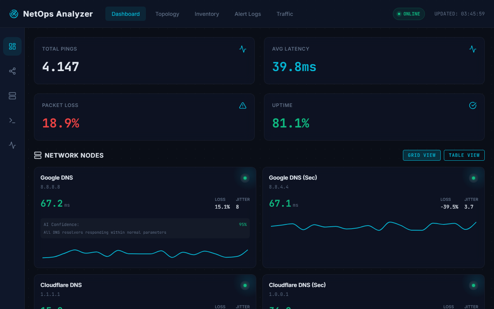
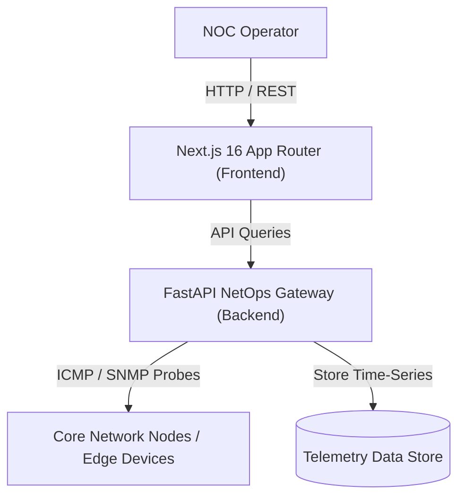

# 🌐 NetOps Analyzer (Next.js 16 + AI Network Telemetry & Anomaly Engine)

<div align="center">
  
</div>

<br />

<div align="center">
  
  
  
  
  
</div>

---

## 🚀 Overview

**NetOps Analyzer** is an enterprise-class network observability and anomaly detection platform designed for continuous network performance monitoring, ICMP/SNMP telemetry analysis, and automated threat/jitter isolation.

Featuring a **Next.js 16 App Router** dashboard equipped with AI Anomaly Confidence Zones, interactive topology inspections, and instant Command Palette controls, it provides Network Operations Centers (NOCs) with sub-second insight into network degradation and bandwidth anomalies.

---

## ✨ Key Enterprise Features

- **🧠 AI Anomaly Confidence Zones**: Automatically overlays baseline confidence intervals on throughput and latency telemetry to instantly highlight traffic surges or packet loss.
- **📡 Real-Time ICMP & Telemetry Polling**: Continuous telemetry collection from edge routers, switches, and core network nodes.
- **📊 Responsive Glassmorphism Telemetry Grid**: High-density interactive charts built with **Recharts** and **Framer Motion** for smooth, zero-layout-shift visualization.
- **⚡ Keyboard Command Palette (`Ctrl+K`)**: Rapid execution of network operations (e.g., BGP route dampening, interface isolation, traceroute triggers).
- **🐳 Hardened Container Deployment**: Optimized for zero-downtime containerized deployments with kernel ICMP privileges.

---

## 🏛️ System Architecture



---

## 🛠️ Quick Start (Docker Compose)

Deploy the full enterprise observability suite locally:

```bash
# Clone the repository
git clone https://github.com/Christophep52/netops-analyzer.git
cd netops-analyzer

# Launch full stack (Next.js 16 + FastAPI)
docker compose up --build -d
```

Access the applications:
- **Enterprise Observability UI**: `http://localhost:3003`
- **FastAPI Telemetry Gateway Docs**: `http://localhost:8003/docs`

---

## 💻 Local Development Setup

### 1. Backend (FastAPI)
```bash
cd backend
python -m venv venv
source venv/bin/activate
pip install -r requirements.txt
uvicorn main:app --reload --port 8000
```

### 2. Frontend (Next.js 16)
```bash
cd frontend-next
npm install
npm run dev
```

---

## 📄 License

Distributed under the MIT License. Designed for mission-critical enterprise Network Operations Centers.
