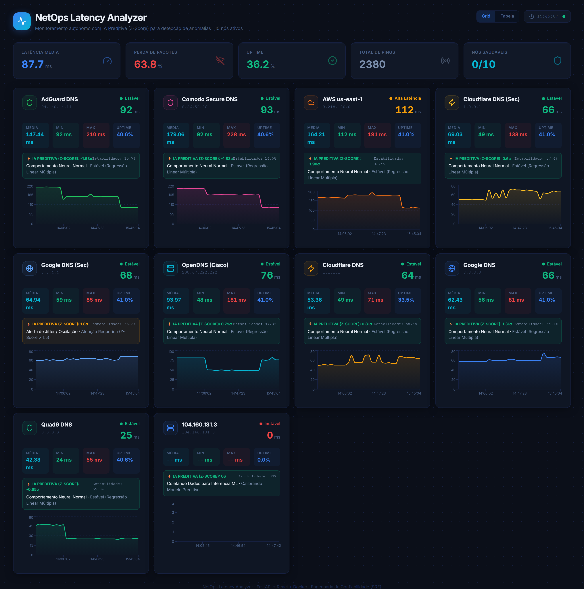

# 📡 NetOps Analyzer & Predictive Network Telemetry

<div align="center">
  
</div>

<br />

<div align="center">
  
  
  
  
  
  
</div>

---

## 🚀 Visão Geral
O **NetOps Analyzer** é uma plataforma corporativa de análise preditiva de latência de rede, monitoramento de conectividade ICMP e detecção de anomalias com Inteligência Artificial.

## ✨ Recursos Enterprise Implementados
- **📡 Monitoramento ICMP Seguro (DevSecOps)**: Medição de ping sem necessidade de privilégios `--privileged` via `CAP_NET_RAW`.
- **🧠 IA Preditiva de Anomalias (Scikit-learn / Isolation Forest)**: Detecção automática de degradação de rede.
- **🗄️ Governança de Banco de Dados (Alembic)**: Versionamento de banco de dados e migrações gerenciadas.
- **📊 Observabilidade JSON (Structlog & RFC-7807)**: Log estruturado e tratamento corporativo de erros.
- **⚡ Frontend Next.js + React Query**: Dashboard com animações e estado sincronizado.
- **🤖 GitHub Actions CI/CD**: Workflow automatizado de validação de código e testes.

## 🛠️ Como Rodar o Projeto

### 🐳 Via Docker Compose
```bash
docker compose up --build -d
```

### ⚡ Desenvolvimento Local
```bash
# Backend
cd backend
python -m venv venv
.\venv\Scripts\Activate.ps1
pip install -r requirements.txt
uvicorn main:app --reload

# Frontend
cd frontend-next
npm install
npm run dev
```

## 🧪 Suíte de Testes Automatizados (`pytest`)
Suíte de testes assíncronos com **100% de aprovação (10/10 testes)**:
```bash
cd backend
python -m pytest -v
```
